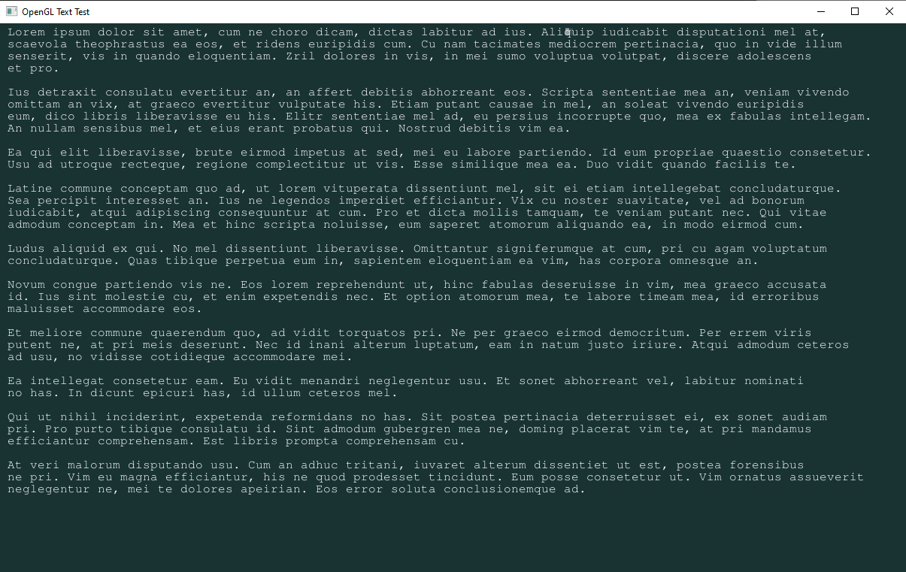

# OpenGL_Text ( made for codeblocks )

I originally found the demo code here :  
https://github.com/sebbekarlsson/textviewgl
  
However, I found several issues with it at the time I looked into it. So I fixed several errors, not to mention the text file itself. I also set the windows as resizable, with the text lines resizing along with the window.  
I also fixed a pesky bug where it would display characters that were not in the text file.  
His code looked like a Linux only version, but this repo will work on Windows and Linux. I tested this on windows, with codeblocks.  
I compiled and supplied the freetype library that GCC would need. Just make sure your paths are correct.  
I removed the old archaic library known as GLEW and replaced it with GLAD.  
If you try to use this code with Visual Studio or some other compiler, make sure to recompile the freetype library. You will need to get a fresh copy of freetype from here :  
https://freetype.org/

I compiled freetype ( and the project ) with C17 and in 64-Bit without issues.  
  
 
